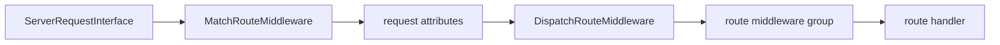

# Componenta Router

Runtime HTTP router for Componenta applications. The package provides immutable route records, fluent route building, route groups, route collections, path pattern compilation, optimized compiled routes, URL generation, PSR-15 route matching and dispatch middleware, handler resolution, and router exception handlers.

Attribute discovery, production route-cache generation, and HTTP-interceptor route handler resolution live in `componenta/router-app`.

## Installation

```bash
composer require componenta/router
```

## Package Boundaries

`componenta/router` owns runtime routing behavior. It can work with explicitly registered routes and does not require class scanning.

## Related Packages

| Package | Why it matters here |
|---|---|
| `componenta/http-responder` | Provides HTTP response helpers; router only selects handlers and does not format controller output. |
| `componenta/middleware-factory` | Turns strings, classes, groups, and middleware instances into `MiddlewareInterface`. |
| `componenta/di` | Creates route handlers and middleware from the container when needed. |
| `componenta/router-app` | Discovers `#[Route]` attributes, builds route cache files, and provides application HTTP-interceptor route handler resolution. |

Use `componenta/router` for:

- route records and route collections;
- route matching and URL generation;
- grouped routes and middleware groups;
- PSR-15 matching/dispatch middleware;
- compiled route collections loaded from cache;
- route exception handling.

Use `componenta/router-app` for:

- discovering `#[Route]` attributes;
- generating route cache files;
- integrating route compilation with the application cache pipeline;
- resolving route handlers through HTTP interceptors.

## Route Records

`RouteRecord` is an immutable route definition.

```php
use Componenta\Http\Router\RouteRecord;

$route = RouteRecord::get(
    name: 'posts.show',
    path: '/posts/{id}',
    handler: ShowPostController::class,
    middlewares: ['auth'],
    tokens: ['id' => '[0-9a-f-]{36}'],
);
```

Public fields:

| Field | Type | Meaning |
|---|---|---|
| `name` | `string` | Unique route name used for matching result and URL generation. |
| `path` | `string` | Normalized route path. |
| `handler` | `RouteHandler` | Handler definition wrapped as route middleware. |
| `methods` | `list<string>` | Uppercase HTTP methods. |
| `middlewares` | `?MiddlewareGroup` | Route-level middleware group. |
| `tokens` | `array<string, string>` | Regex constraints for path parameters. |
| `defaults` | `array<string, mixed>` | Scalar defaults for optional parameters. |
| `group` | `?string` | Group name to apply through `Routes`. |

Static constructors exist for `get`, `post`, `put`, `patch`, `delete`, `head`, `options`, and `any`.

`RouteRecord` validates early:

- method list must not be empty;
- every method must be a non-empty string;
- token patterns must be valid regular expressions;
- default values must be scalar or null.

## Fluent Builder

`RouteBuilder` is useful when a route is assembled conditionally.

```php
use Componenta\Http\Router\RouteBuilder;

$route = RouteBuilder::get('posts.show', '/posts/[id]')
    ->handler(ShowPostController::class)
    ->token('id', '[0-9a-f-]{36}')
    ->default('preview', false)
    ->group('public')
    ->build();
```

`build()` throws `LogicException` when no handler was set.

## Path Syntax

The default compiler uses `CompositeSyntax`, so several parameter syntaxes are accepted:

| Syntax | Meaning |
|---|---|
| `/posts/{id}` | Required parameter. |
| `/posts/[id]` | Required parameter. |
| `/posts/:id` | Required parameter in colon syntax. |
| `/posts/[?page]` | Optional parameter. |
| `/posts/[id:\d+]` | Inline regex constraint. |
| `/posts/[?page:\d+=1]` | Optional parameter with regex and default. |

Explicit `tokens` override inline tokens. Explicit `defaults` override inline defaults.

## Groups

`RouteGroup` applies name prefix, path prefix, middleware, tokens, and defaults to child routes.

```php
$routes = new Routes();

$api = $routes->group('api', '/api', middleware: ['api']);
$admin = $api->group('admin', '/admin', middleware: ['auth', 'admin']);

$admin->get('dashboard', '/dashboard', AdminDashboardController::class);
```

The route above is registered as:

- name: `api.admin.dashboard`
- path: `/api/admin/dashboard`
- middleware: `api`, `auth`, `admin`
- group: `api.admin`

Nested groups are registered in the parent collection, so later routes can reference the full group name explicitly.

## Route Collection

`Routes` implements:

- `RouteCollectorInterface`
- `MatcherInterface`
- `GeneratorInterface`
- `Countable`
- `IteratorAggregate`

```php
$routes = new Routes();
$routes->addRoute(RouteRecord::get('home', '/', HomeController::class));

$match = $routes->match($routes, '/', 'GET');
$url = $routes->generate($routes, 'home');
```

`Routes` compiles static and dynamic lookup tables lazily after registration. Static routes use hash lookup. Dynamic routes use compiled regex patterns.

## Router Facade

`Router` combines a route collector, matcher, and generator.

```php
$router = Router::fromDnf($routes);

$match = $router->match('/posts/42', 'GET');
$url = $router->generate('posts.show', ['id' => 42]);
```

`match()` throws:

- `RouteNotFoundException` when no route matches URI and method;
- `MethodNotAllowedException` when the URI matches but the method is not allowed.

`generate()` throws:

- `RouteNotRegisteredException` when the route name is missing;
- `InvalidArgumentException` when required parameters are missing or invalid.

## Match Result

`MatchResult` contains data needed for dispatch:

| Field | Type |
|---|---|
| `name` | `string` |
| `handler` | `RouteHandler` |
| `middlewares` | `?MiddlewareGroup` |
| `parameters` | `array<string, mixed>` |
| `route` | `RouteRecord` lazy property |

Matched parameters are cast from numeric strings to integers or floats when possible.

## PSR-15 Middleware

`MatchRouteMiddleware` matches the incoming request and stores the result in request attributes:

- `MatchRouteMiddleware::ATTRIBUTE_MATCH_RESULT`
- every matched route parameter under its parameter name

`DispatchRouteMiddleware` reads the match result and resolves route middleware through `MiddlewareFactory`.



`DispatchRouteMiddleware` resolves route middleware on every request. `MemoizedDispatchRouteMiddleware` keeps the same dispatch flow, but caches the resolved PSR-15 middleware object by route name.

The memoized variant does not cache `ServerRequestInterface`, route parameters, the terminal handler, or route handler results. Disable it when middleware definitions are intentionally request-dependent or container resolution is intentionally transient.

## Router Exception Handlers

| Handler | Behavior |
|---|---|
| `ThrowingRouterExceptionHandler` | Re-throws router exceptions for a global error handler. |
| `RouterExceptionHandler` | Returns 404 or 405 PSR-7 responses. |
| `JsonRouterExceptionHandler` | Returns JSON 404/405 responses and `Allow` for 405. |
| `CallableRouterExceptionHandler` | Delegates handling to a closure. |

## Compiled Routes

`CompiledRoutes` is the optimized production collection loaded from a generated cache file.

```php
$routes = CompiledRoutes::fromCache($cacheFile);
$router = Router::fromDnf($routes);
```

Performance model:

- static routes use O(1) hash lookup;
- dynamic routes can use one regex per HTTP method;
- large dynamic sets can be split into chunks;
- prefix index reduces the number of chunks checked;
- route handlers and middleware groups are initialized lazily.

The cache file is generated by `RouteCacheGenerator`, usually through `componenta/router-app`.

## Attribute Route Metadata

`#[Route]` is the runtime metadata class consumed by application discovery.

```php
use Componenta\Http\Router\Attribute\Route;

#[Route('posts.show', '/posts/[id:\d+]', 'GET', middlewares: ['web'])]
final readonly class ShowPostController
{
    public function __invoke(int $id): ResponseInterface
    {
        // ...
    }
}
```

Constructor:

```php
public function __construct(
    string $name,
    string $path,
    array|string $methods = ['GET'],
    array|string $middlewares = [],
    array $tokens = [],
    array $defaults = [],
    ?string $group = null,
    int $priority = 0,
)
```

`methods` accepts a string (`'GET'`), a `|`-separated string (`'GET|POST'`), or an array (`['GET', 'POST']`). `priority` is used by `componenta/router-app`: when multiple attribute routes can match the same URI, the route with the higher `priority` is added first.

The base router package does not scan this attribute. Discovery belongs to `componenta/router-app`.

## Configuration

`ConfigProvider` registers:

- `RouteLocatorInterface`
- `Router`
- `MatchRouteMiddleware`
- `DispatchRouteMiddleware`
- `RouteHandlerResolver`
- `Compiler`
- `ThrowingRouterExceptionHandler`
- aliases for `CompilerInterface`, `RouterExceptionHandlerInterface`, `MatcherInterface`, and `GeneratorInterface`

Config keys:

| Key | Meaning |
|---|---|
| `ConfigKey::ROUTES_FILE` | Path to route definition file. |
| `ConfigKey::ROUTES_CACHE_FILE` | Optional explicit route cache file path. |
| `ConfigKey::CACHE_RESOLVED_ROUTE_MIDDLEWARE` | Allows the factory to return `MemoizedDispatchRouteMiddleware` instead of plain `DispatchRouteMiddleware` when `COMPILED_PIPELINE` is also enabled. |
| `ConfigKey::COMPILED_PIPELINE` | Enables compiled router fast paths and allows memoized dispatch. |

## Failure Model

| Exception | When |
|---|---|
| `RouteAlreadyExistsException` | Duplicate route name registration. |
| `RouteNotRegisteredException` | URL generation references unknown route name. |
| `RouteNotFoundException` | URI/method cannot be matched. |
| `MethodNotAllowedException` | URI matches a route, but method is not allowed. |
| `GroupNotFoundException` | Requested group is absent. |
