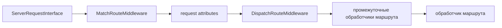

# Componenta Router

HTTP-роутер для PHP 8.4+ и PSR-7/PSR-15 приложений. Пакет отвечает за регистрацию маршрутов, сопоставление запроса с маршрутом, генерацию URL, группировку маршрутов, выполнение промежуточных обработчиков маршрута, прямое разрешение обработчиков маршрута через DI и загрузку скомпилированного кеша маршрутов.

**[English](README.md)** | **[Russian](README.ru.md)**

## Зависимости

Версия PHP:

| Требование | Версия |
|---|---|
| PHP | `^8.4` |

Пакеты:

| Пакет | Назначение |
|---|---|
| `psr/container` | Получение роутера, промежуточных обработчиков, обработчиков маршрутов и фабрик из контейнера. |
| `psr/http-message` | PSR-7 запросы и ответы. |
| `psr/http-server-middleware` | PSR-15 `MiddlewareInterface` и `RequestHandlerInterface`. |
| `componenta/arrayable` | Контракт `Arrayable` для коллекций маршрутов и групп. |
| `componenta/config` | `Config`, окружение и ключи конфигурации роутера. |
| `componenta/di` | Вызов обработчиков маршрута через DI и регистрация фабрик в `ConfigProvider`. |
| `componenta/http-responder` | `Responder` и создание HTTP-ответов; роутер только выбирает обработчик. |
| `componenta/middleware-factory` | Превращение строк, классов, групп и `RouteHandler` в PSR-15 промежуточные обработчики. |
| `componenta/path-resolver` | Разрешение путей к файлам маршрутов и кеша относительно корня приложения. |
| `componenta/var-export` | Генерация исполняемого PHP-файла кеша маршрутов. |

Установка:

```bash
composer require componenta/router
```

## Связанные пакеты

| Пакет | Зачем нужен здесь |
|---|---|
| [componenta/router-app](../router-app/README.ru.md) | Сканирует `#[Route]`, собирает маршруты из атрибутов, подключает компиляцию маршрутов и резолвер уровня приложения с HTTP-перехватчиками. |
| `componenta/config` | Передает `ConfigKey::ROUTES_FILE`, `ConfigKey::ROUTES_CACHE_FILE` и флаги производительности. |
| `componenta/path-resolver` | Позволяет задавать пути к файлам маршрутов относительно корня проекта. |
| `componenta/middleware-factory` | Разрешает промежуточные обработчики маршрута и сам `RouteHandler` перед выполнением. |
| `componenta/di` | Вызывает callable-обработчики с автоматическим разрешением параметров. |

`componenta/router` не сканирует классы и не ищет атрибуты сам. В базовом пакете маршруты регистрируются явно через `Routes`, `RouteRecord`, `RouteBuilder` или загружаются из PHP-файла. Обнаружение атрибутов относится к `componenta/router-app`.

## Интерфейсы

| Интерфейс | Методы | Когда использовать |
|---|---|---|
| `RouteCollectorInterface` | `has()`, `getRoute()`, `toArray()`, `count()`, `getIterator()` | Хранить и читать коллекцию маршрутов. |
| `MatcherInterface` | `match()` | Сопоставить URI и HTTP-метод с маршрутом. |
| `GeneratorInterface` | `generate()` | Построить URL по имени маршрута и параметрам. |
| `CompilerInterface` | `compile()`, `isParametrized()` | Разобрать шаблон пути и получить regex/параметры. |
| `RouteLocatorInterface` | `getRoutes()` | Загрузить коллекцию маршрутов из файла или кеша. |
| `SyntaxParserInterface` | `parse()`, `toRegex()`, `buildPath()` и др. | Добавить свой синтаксис параметров пути. |
| `SyntaxConverterInterface` | `toColonSyntax()` | Привести путь к colon-синтаксису для кеша. |

`Routes` реализует `RouteCollectorInterface`, `MatcherInterface` и `GeneratorInterface`. `CompiledRoutes` реализует те же интерфейсы, но читает уже скомпилированную структуру из кеша.

`Router` является фасадом над тремя контрактами:

```php
use Componenta\Http\Router\Router;

$router = new Router(
    routes: $routes,
    matcher: $matcher,
    generator: $generator,
);
```

Если один объект реализует все три контракта, используйте `Router::fromDnf($routes)`.

## Быстрый старт

```php
use Componenta\Http\Router\RouteRecord;
use Componenta\Http\Router\Router;
use Componenta\Http\Router\Routes;

$routes = new Routes();

$routes->addRoute(RouteRecord::get(
    name: 'posts.show',
    path: '/posts/{id}',
    handler: ShowPostController::class,
));

$router = Router::fromDnf($routes);

$match = $router->match('/posts/42', 'GET');
$url = $router->generate('posts.show', ['id' => 42]);
```

Результат:

```php
$match->name;       // 'posts.show'
$match->parameters; // ['id' => 42]
$url;               // '/posts/42'
```

Числовые параметры пути приводятся к `int` или `float`, если строка действительно выглядит как число. Остальные значения остаются строками.

## Маршруты

`RouteRecord` - иммутабельное описание маршрута.

```php
use Componenta\Http\Router\RouteRecord;

$route = RouteRecord::get(
    name: 'posts.show',
    path: '/posts/{uuid}',
    handler: [PostController::class, 'show'],
    middlewares: ['web', 'auth.optional'],
    tokens: ['uuid' => '[0-9a-f-]{36}'],
    defaults: ['preview' => false],
);
```

Публичные свойства:

| Свойство | Тип | Значение |
|---|---|---|
| `name` | `string` | Уникальное имя маршрута. Используется в `MatchResult` и генерации URL. |
| `path` | `string` | Нормализованный путь. |
| `handler` | `RouteHandler` | Обертка над описанием обработчика. |
| `methods` | `list<string>` | HTTP-методы в верхнем регистре, без дублей. |
| `middlewares` | `?MiddlewareGroup` | Промежуточные обработчики конкретного маршрута. |
| `tokens` | `array<string, string>` | Regex-ограничения параметров пути. |
| `defaults` | `array<string, mixed>` | Значения по умолчанию для необязательных параметров. |
| `group` | `?string` | Имя группы, настройки которой нужно применить при добавлении в `Routes`. |

Статические конструкторы:

| Метод | HTTP-методы |
|---|---|
| `RouteRecord::get()` | `GET` |
| `RouteRecord::post()` | `POST` |
| `RouteRecord::put()` | `PUT` |
| `RouteRecord::patch()` | `PATCH` |
| `RouteRecord::delete()` | `DELETE` |
| `RouteRecord::head()` | `HEAD` |
| `RouteRecord::options()` | `OPTIONS` |
| `RouteRecord::any()` | `GET`, `POST`, `PUT`, `DELETE`, `PATCH`, `HEAD`, `OPTIONS` |

Конструктор нормализует путь:

| Вход | Результат |
|---|---|
| `users` | `/users` |
| `/users/` | `/users` |
| `/users//list` | `/users/list` |
| `/` | `/` |

`RouteRecord` валидирует маршрут сразу:

- список методов не может быть пустым;
- каждый метод должен быть непустой строкой;
- regex в `tokens` должен быть валидным;
- ключи `defaults` должны быть непустыми строками;
- значения `defaults` должны быть скалярами или `null`.

Методы `withPrefix()`, `withMiddlewares()`, `withTokens()`, `withDefaults()`, `withGroup()`, `withMethods()`, `withHandler()` и `withName()` возвращают новый `RouteRecord`.

`toArray()` возвращает сериализуемое описание маршрута, `fromArray()` восстанавливает маршрут из такого массива.

## RouteBuilder

`RouteBuilder` удобен, когда маршрут собирается постепенно.

```php
use Componenta\Http\Router\RouteBuilder;

$route = RouteBuilder::get('posts.show', '/posts/[id]')
    ->handler([PostController::class, 'show'])
    ->token('id', '\d+')
    ->default('preview', false)
    ->group('web')
    ->build();
```

Методы:

| Метод | Что делает |
|---|---|
| `RouteBuilder::get()`, `post()`, `put()`, `patch()`, `delete()`, `head()`, `options()` | Создают билдер с одним HTTP-методом. |
| `RouteBuilder::route()` | Создает билдер без метода. Если не вызвать `methods()`, `build()` создаст маршрут на все основные методы. |
| `handler(mixed $handler)` | Задает обработчик маршрута. |
| `methods(string ...$methods)` | Добавляет HTTP-методы. |
| `token(string $name, string $pattern)` | Добавляет одно regex-ограничение параметра. |
| `tokens(array $tokens)` | Добавляет несколько ограничений. |
| `default(string $name, mixed $value)` | Добавляет одно значение по умолчанию. |
| `defaults(array $defaults)` | Добавляет несколько значений по умолчанию. |
| `group(string $name)` | Указывает группу маршрута. |
| `build()` | Возвращает `RouteRecord`. |

`build()` бросает `LogicException`, если обработчик не задан.

## Синтаксис пути

Стандартный `Compiler` использует `CompositeSyntax`, который автоматически выбирает подходящий синтаксис параметров.

| Синтаксис | Пример | Значение |
|---|---|---|
| Фигурные скобки | `/posts/{id}` | Обязательный параметр. |
| Фигурные скобки, необязательный параметр | `/archive/{year?}` | Необязательный параметр. |
| Квадратные скобки | `/posts/[id]` | Обязательный параметр. |
| Квадратные скобки, необязательный параметр | `/archive/[?year]` | Необязательный параметр. |
| Двоеточие | `/posts/:id` | Обязательный параметр. |
| Угловые скобки | `/posts/<id>` | Обязательный параметр. |
| Ограничение внутри пути | `/posts/[id:\d+]` | Параметр с regex-ограничением. |
| Значение по умолчанию внутри пути | `/archive/[?year:\d+=2024]` | Необязательный параметр с regex-ограничением и значением по умолчанию. |

Дефолтные regex-паттерны из `CompilerInterface::DEFAULT_PATTERNS` применяются по имени параметра:

| Имя параметра | Regex |
|---|---|
| `id` | `\d+` |
| `uuid` | `[0-9a-f]{8}-[0-9a-f]{4}-[0-9a-f]{4}-[0-9a-f]{4}-[0-9a-f]{12}` |
| `slug` | `[a-z0-9-]+` |
| `any` | `.+` |

Порядок переопределения ограничений:

1. дефолтные паттерны компилятора;
2. inline-ограничения в шаблоне пути;
3. явные `tokens` маршрута.

Порядок переопределения значений по умолчанию:

1. inline-default в шаблоне пути;
2. явные `defaults` маршрута.

Пример генерации:

```php
$routes->addRoute(RouteRecord::get(
    'archive',
    '/archive/{year?}',
    ArchiveController::class,
    defaults: ['year' => 2024],
));

$router->generate('archive'); // '/archive/2024'
```

Если необязательный параметр не имеет значения по умолчанию и не передан в `generate()`, сегмент пути удаляется:

```php
$routes->addRoute(RouteRecord::get('archive', '/archive/{year?}', ArchiveController::class));

$router->generate('archive'); // '/archive'
```

Если обязательный параметр не передан или значение не проходит `tokens`, `generate()` бросит `InvalidArgumentException`.

## Группы

`RouteGroup` применяет к дочерним маршрутам:

- префикс имени;
- префикс пути;
- промежуточные обработчики;
- `tokens`;
- `defaults`.

```php
use Componenta\Http\Router\Routes;

$routes = new Routes();

$api = $routes->group('api', '/api', middleware: ['api']);
$admin = $api->group('admin', '/admin', middleware: ['auth', 'admin']);

$admin->get('dashboard', '/dashboard', AdminDashboardController::class);
```

Итоговый маршрут:

| Поле | Значение |
|---|---|
| Имя | `api.admin.dashboard` |
| Путь | `/api/admin/dashboard` |
| Промежуточные обработчики | `api`, `auth`, `admin` |
| Группа | `api.admin` |

Промежуточные обработчики группы выполняются раньше промежуточных обработчиков самого маршрута. Если внутри группы нужны обработчики конкретного маршрута, передайте готовый `RouteRecord` через `addRoute()`:

```php
$admin->addRoute(RouteRecord::get(
    name: 'reports',
    path: '/reports',
    handler: ReportsController::class,
    middlewares: ['audit'],
));
```

Итоговый список промежуточных обработчиков будет: `api`, `auth`, `admin`, `audit`.

Вложенные группы регистрируются в родительской коллекции. Поэтому маршрут можно добавить и напрямую в `Routes`, указав полное имя группы:

```php
$routes->addRoute(RouteRecord::get(
    name: 'settings',
    path: '/settings',
    handler: SettingsController::class,
)->withGroup('api.admin'));
```

## Коллекция и роутер

`Routes` хранит маршруты и умеет сама выполнять match/generate.

```php
use Componenta\Http\Router\RouteRecord;
use Componenta\Http\Router\Routes;

$routes = new Routes();
$routes->addRoute(RouteRecord::get('home', '/', HomeController::class));

$match = $routes->match($routes, '/', 'GET');
$url = $routes->generate($routes, 'home');
```

Поведение `Routes`:

| Операция | Поведение |
|---|---|
| `addRoute()` | Добавляет маршрут, применяет группу, если `group` задан и зарегистрирован. |
| `has()` | Проверяет маршрут по имени. |
| `getRoute()` | Возвращает маршрут или бросает `RouteNotRegisteredException`. |
| `match()` | Сопоставляет URI и метод, лениво компилирует таблицы маршрутов после изменений. |
| `generate()` | Строит URL по имени маршрута. |
| `toArray()` | Возвращает массив `name => RouteRecord`. |
| `count()` и `getIterator()` | Позволяют считать и обходить маршруты. |

`Routes` использует два внутренних индекса:

| Индекс | Что дает |
|---|---|
| Статические маршруты | O(1) поиск по методу и URI. |
| Динамические маршруты | Список скомпилированных regex по методу. |

`Router` скрывает DNF-сигнатуры `match($routes, ...)` и `generate($routes, ...)`:

```php
use Componenta\Http\Router\Router;

$router = Router::fromDnf($routes);

$match = $router->match('/posts/42', 'GET');
$url = $router->generate('posts.show', ['id' => 42]);
```

`match()` нормализует URI: пустой путь и путь без ведущего `/` приводятся к пути с `/`.

Исключения `match()`:

| Исключение | Когда возникает |
|---|---|
| `RouteNotFoundException` | Нет маршрута с таким URI. |
| `MethodNotAllowedException` | URI совпал с маршрутом, но HTTP-метод запрещен. |

Исключения `generate()`:

| Исключение | Когда возникает |
|---|---|
| `RouteNotRegisteredException` | Имя маршрута не зарегистрировано. |
| `InvalidArgumentException` | Нет обязательного параметра или параметр не проходит regex. |

## MatchResult

`MatchResult` содержит данные найденного маршрута:

| Свойство | Тип | Значение |
|---|---|---|
| `name` | `string` | Имя маршрута. |
| `handler` | `RouteHandler` | Обработчик маршрута. |
| `middlewares` | `?MiddlewareGroup` | Промежуточные обработчики маршрута после применения групп. |
| `parameters` | `array<string, mixed>` | Параметры пути с приведением числовых строк. |
| `route` | `RouteRecord` | Лениво получаемая полная запись маршрута. |

Для `CompiledRoutes` свойство `route` восстанавливает `RouteRecord` из кешированных данных только при первом обращении.

## Обработчики маршрута

`RouteRecord` принимает `mixed $handler`, но при выполнении обработчик всегда оборачивается в `RouteHandler`, а затем разрешается через `componenta/middleware-factory`.

Типичные формы обработчика:

| Форма | Как выполняется |
|---|---|
| `Closure` | Вызывается через callable executor с DI-разрешением параметров. |
| Строковый идентификатор сервиса | Получается из контейнера и вызывается как callable. |
| `ClassName::class` | Получается из контейнера и вызывается как invokable-сервис. |
| `[ClassName::class, 'method']` | Объект получается из контейнера, затем вызывается метод. Статический метод вызывается без контейнера. |
| `MiddlewareInterface` или class-string промежуточного обработчика | Выполняется через `process()`. |
| `RequestHandlerInterface` или class-string handler | Выполняется через `handle()`. |

Роутер сам не создает объекты обработчиков из class-string. Class-string должен быть доступен через контейнер, например как явно зарегистрированный сервис или как класс, который ваш контейнер умеет автоматически собирать.

`RouteHandlerResolver` выполняет обработчик напрямую через DI.

Если обработчик должен проходить через HTTP-перехватчики, используйте `InterceptedRouteHandlerResolver` из пакета `componenta/router-app`. Базовый `componenta/router` не зависит от `componenta/interceptor`.

Результат обработчика должен быть:

| Результат | Что произойдет |
|---|---|
| `ResponseInterface` | Ответ возвращается как есть. |
| `MiddlewareInterface` | Будет вызван `process($request, $handler)`. |
| `RequestHandlerInterface` | Будет вызван `handle($request)`. |
| Любое другое значение | Будет передано в `Responder`, если он зарегистрирован; иначе будет `UnexpectedValueException`. |

## PSR-15 промежуточные обработчики

`MatchRouteMiddleware` сопоставляет входящий запрос с маршрутом.

При успешном сопоставлении он добавляет в request attributes:

| Атрибут | Значение |
|---|---|
| `MatchRouteMiddleware::ATTRIBUTE_MATCH_RESULT` | Объект `MatchResult`. |
| имя каждого параметра маршрута | Значение параметра из `MatchResult::parameters`. |

```php
use Componenta\Http\Router\Middleware\MatchRouteMiddleware;

$match = MatchRouteMiddleware::getMatchResultFromRequest($request);
```

Если сопоставление завершилось ошибкой, `MatchRouteMiddleware` передает исключение в `RouterExceptionHandlerInterface`.

`DispatchRouteMiddleware` читает `MatchResult`, собирает промежуточные обработчики маршрута и обработчик маршрута в один промежуточный обработчик через `MiddlewareFactory`, затем выполняет его.



Если `MatchResult` в запросе отсутствует, `DispatchRouteMiddleware` просто передает запрос следующему обработчику.

`DispatchRouteMiddleware` разрешает промежуточные обработчики маршрута на каждый запрос. `MemoizedDispatchRouteMiddleware` наследует то же выполнение, но кеширует уже собранный PSR-15 объект по имени маршрута.

`MemoizedDispatchRouteMiddleware` ускоряет повторные запросы к одному маршруту, но используйте его только когда список промежуточных обработчиков маршрута и способ его разрешения стабильны. Он не кеширует `ServerRequestInterface`, параметры маршрута, следующий обработчик или результат обработчика.

## Обработчики ошибок роутера

`RouterExceptionHandlerInterface` обрабатывает только ошибки роутера: `RouteNotFoundException`, `MethodNotAllowedException` и другие наследники `RouterException`.

| Обработчик | Поведение |
|---|---|
| `ThrowingRouterExceptionHandler` | Повторно выбрасывает ошибку. Это стандартный обработчик из `ConfigProvider`. |
| `RouterExceptionHandler` | Возвращает PSR-7 ответ для 404 или 405. |
| `JsonRouterExceptionHandler` | Возвращает JSON-ответ для 404/405 и выставляет `Allow` для 405. |
| `CallableRouterExceptionHandler` | Передает ошибку и запрос пользовательскому callable. |

`MethodNotAllowedException::getAllowHeader()` возвращает строку для HTTP-заголовка `Allow`.

## Конфигурация

`Componenta\Http\Router\ConfigProvider` регистрирует фабрики, invokable-классы и алиасы для стандартной сборки роутера.

Регистрируемые фабрики:

| Сервис | Фабрика |
|---|---|
| `RouteLocatorInterface` | `RouteLocatorFactory` |
| `Router` | `RouterFactory` |
| `MatchRouteMiddleware` | `MatchRouteMiddlewareFactory` |
| `DispatchRouteMiddleware` | `DispatchRouteMiddlewareFactory`; фабрика может вернуть `MemoizedDispatchRouteMiddleware`, если включена мемоизация маршрута |
| `RouteHandlerResolver` | `RouteHandlerResolverFactory` |

Invokable-сервисы:

| Сервис | Назначение |
|---|---|
| `Compiler` | Компиляция шаблонов пути. |
| `ThrowingRouterExceptionHandler` | Стандартный обработчик ошибок роутера. |

Основные алиасы:

| Алиас | Цель |
|---|---|
| `CompilerInterface` | `Compiler` |
| `RouterExceptionHandlerInterface` | `ThrowingRouterExceptionHandler` |
| `MatcherInterface` | `Routes` |
| `GeneratorInterface` | `Routes` |

Ключи конфигурации:

| Ключ | Значение |
|---|---|
| `ConfigKey::ROUTES_FILE` | Путь к PHP-файлу, который регистрирует маршруты. |
| `ConfigKey::ROUTES_CACHE_FILE` | Опциональный путь к скомпилированному файлу кеша маршрутов. |
| `ConfigKey::CACHE_RESOLVED_ROUTE_MIDDLEWARE` | Разрешает фабрике вернуть `MemoizedDispatchRouteMiddleware` вместо обычного `DispatchRouteMiddleware`, если `COMPILED_PIPELINE` тоже включен. |
| `ConfigKey::COMPILED_PIPELINE` | Разрешает быстрый путь скомпилированного роутера и включает возможность мемоизированного выполнения маршрута. |

`RouteLocatorFactory` получает `Config` по `ConfigKey::CONFIG` и `PathResolverInterface` из контейнера. Поэтому значения `ROUTES_FILE` и `ROUTES_CACHE_FILE` можно задавать относительно корня приложения:

```php
use Componenta\Http\Router\ConfigKey;

return [
    ConfigKey::ROUTES_FILE => 'config/routes.php',
    ConfigKey::ROUTES_CACHE_FILE => 'var/cache/router/routes.cache.php',
    ConfigKey::CACHE_RESOLVED_ROUTE_MIDDLEWARE => true,
    ConfigKey::COMPILED_PIPELINE => true,
];
```

`ConfigKey::COMPILED_PIPELINE` является единственным переключателем быстрого пути.

## Файл маршрутов

`RouteLocator` загружает маршруты из PHP-файла. По умолчанию внутри файла доступна переменная `$routes`.

```php
<?php

declare(strict_types=1);

use Componenta\Http\Router\Routes;

/** @var Routes $routes */

$routes->get('home', '/', HomeController::class);
$routes->get('posts.show', '/posts/{id}', [PostController::class, 'show']);
```

Файл можно загрузить напрямую:

```php
use Componenta\Http\Router\Locator\RouteLocator;

$locator = new RouteLocator(__DIR__ . '/routes.php');
$routes = $locator->getRoutes();
```

`getRoutes(array $context = [])` добавляет значения из `$context` в scope файла маршрутов. Имя переменной с коллекцией задается четвертым аргументом конструктора `RouteLocator`, по умолчанию это `routes`.

```php
$locator = new RouteLocator(
    filename: __DIR__ . '/routes.php',
    routesVarName: 'r',
);

$routes = $locator->getRoutes(['apiPrefix' => '/api/v1']);
```

```php
// routes.php
/** @var \Componenta\Http\Router\Routes $r */
/** @var string $apiPrefix */

$api = $r->group('api', $apiPrefix);
```

Если имя файла содержит `.cache` или в конструктор передан `useCache: true`, `RouteLocator` загрузит `CompiledRoutes::fromCache($filename)` вместо выполнения файла маршрутов.

## Кеш и CompiledRoutes

`RouteCacheGenerator` превращает `RouteCollectorInterface` в PHP-файл кеша.

```php
use Componenta\Http\Router\Cache\RouteCacheGenerator;

$generator = new RouteCacheGenerator();
$generator->generate($routes, __DIR__ . '/routes.cache.php');
```

`generate()`:

- компилирует статические и динамические маршруты;
- приводит пути к colon-синтаксису;
- записывает PHP-файл, который возвращает массив кеша;
- создает промежуточные директории;
- пишет файл атомарно через временный файл;
- инвалидирует OPcache для целевого файла, если OPcache доступен.

`CompiledRoutes` загружает этот файл:

```php
use Componenta\Http\Router\CompiledRoutes;
use Componenta\Http\Router\Router;

$routes = CompiledRoutes::fromCache(__DIR__ . '/routes.cache.php');
$router = Router::fromDnf($routes);
```

Модель производительности:

| Тип маршрута | Поведение |
|---|---|
| Статический маршрут | O(1) поиск по методу и URI. |
| Динамические маршруты до лимита | Одно объединенное regex-выражение на HTTP-метод, если оно проходит лимит PCRE. |
| Большой набор динамических маршрутов | Разбиение на чанки и индекс по первому сегменту пути. |
| Обработчики и промежуточные обработчики | `RouteHandler` и `MiddlewareGroup` создаются лениво и переиспользуются внутри `CompiledRoutes`. |

`RouteLocatorFactory` в окружении `production` использует кеш по умолчанию, если:

1. `APP_ENV` соответствует `production`;
2. скомпилированный путь выполнения включен через `ConfigKey::COMPILED_PIPELINE`;
3. файл кеша существует.

Если кеш-файла нет или скомпилированный путь выполнения отключен, используется обычный файл маршрутов.

## Атрибут Route

`#[Route]` - класс метаданных. Базовый пакет хранит атрибут, но не сканирует классы.

```php
use Componenta\Http\Router\Attribute\Route;

#[Route(
    name: 'posts.show',
    path: '/posts/[id:\d+]',
    methods: 'GET',
    middlewares: ['web'],
)]
final readonly class ShowPostController
{
    public function __invoke(int $id): ResponseInterface
    {
        // ...
    }
}
```

Конструктор:

```php
public function __construct(
    string $name,
    string $path,
    array|string $methods = ['GET'],
    array|string $middlewares = [],
    array $tokens = [],
    array $defaults = [],
    ?string $group = null,
    int $priority = 0,
)
```

`methods` принимает строку (`'GET'`), строку с разделителем `|` (`'GET|POST'`) или массив (`['GET', 'POST']`). `priority` используется интеграцией `componenta/router-app`: если несколько атрибутных маршрутов могут совпасть с одним URI, маршрут с большим `priority` добавляется раньше.

Обнаружение `#[Route]` и превращение атрибутов в `RouteRecord` относится к `componenta/router-app`.

## Ошибки

| Исключение | Когда возникает |
|---|---|
| `RouterException` | Базовый класс ошибок роутера. |
| `RouteAlreadyExistsException` | Повторная регистрация имени маршрута. |
| `RouteNotRegisteredException` | Запрошено имя маршрута, которого нет в коллекции. |
| `RouteNotFoundException` | URI не совпал ни с одним маршрутом. |
| `MethodNotAllowedException` | URI совпал, но HTTP-метод запрещен. |
| `GroupNotFoundException` | Запрошенная группа маршрутов не зарегистрирована. |

## Рекомендации

- В обычном коде приложения зависите от `Router`: это стандартная точка для match и generate. `MatcherInterface` и `GeneratorInterface` используйте при ручной сборке роутера или когда вы сами зарегистрировали совместимую реализацию этих контрактов.
- Для публичных и приватных маршрутов используйте группы промежуточных обработчиков, а не дублируйте обработчики в каждом маршруте.
- Для промежуточного обработчика маршрута, который не зависит от конкретного запроса и не должен пересоздаваться контейнером на каждый запрос, оставляйте `CACHE_RESOLVED_ROUTE_MIDDLEWARE` включенным.
- Для больших наборов маршрутов используйте скомпилированный кеш через `RouteCacheGenerator` или интеграцию `componenta/router-app`.
- Не смешивайте регистрацию маршрутов и сканирование атрибутов в базовом пакете: явные маршруты остаются в `componenta/router`, обнаружение атрибутов - в `componenta/router-app`.
